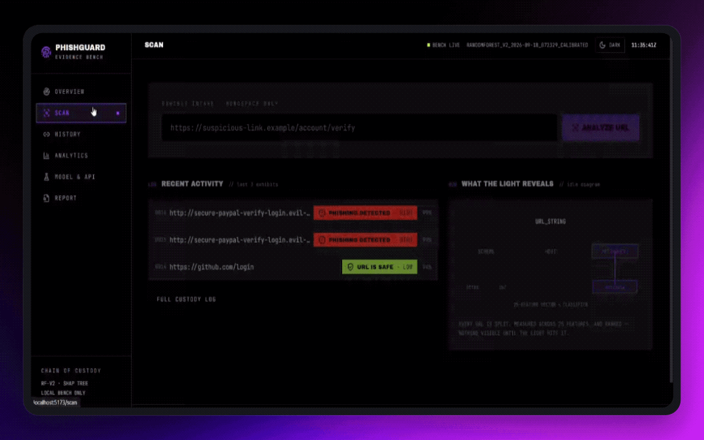
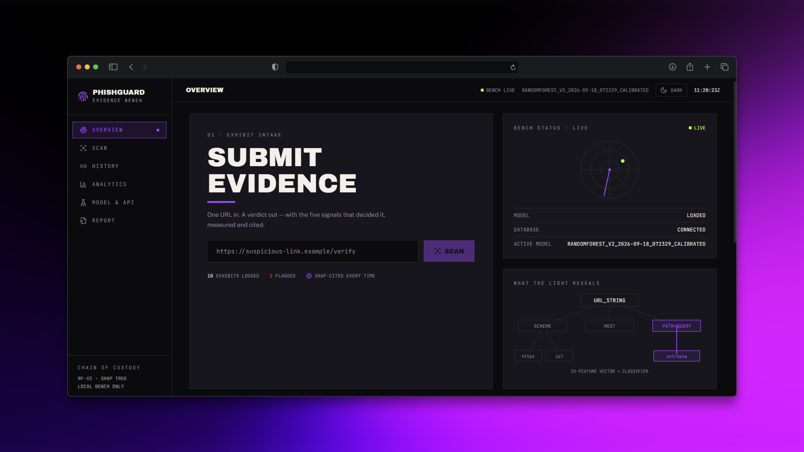
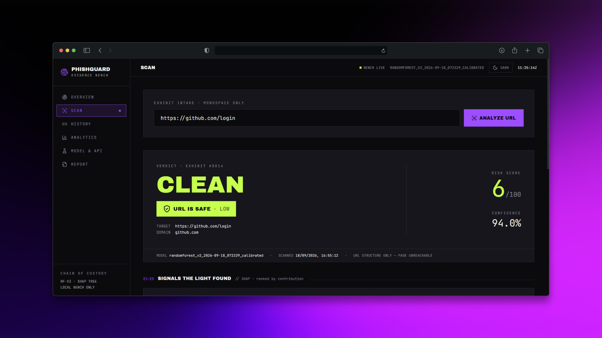
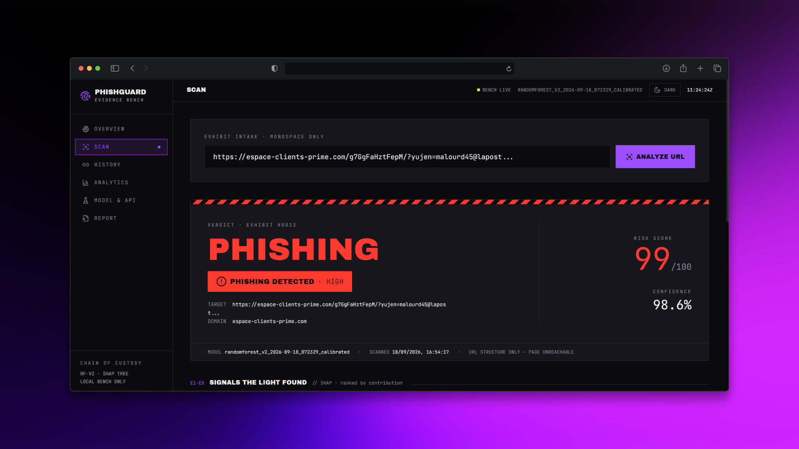
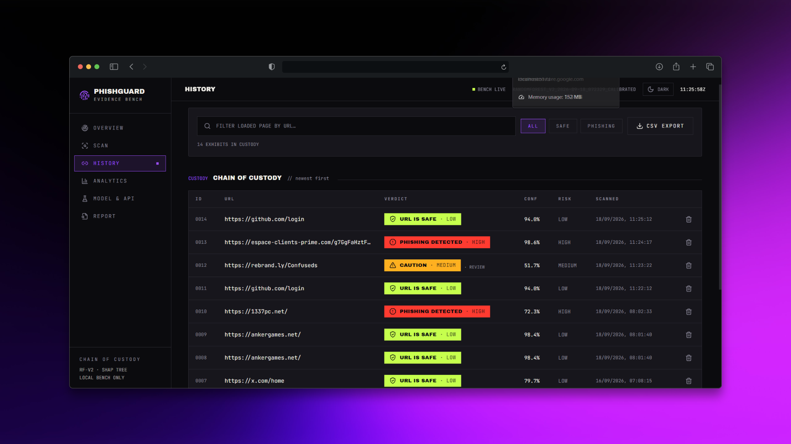
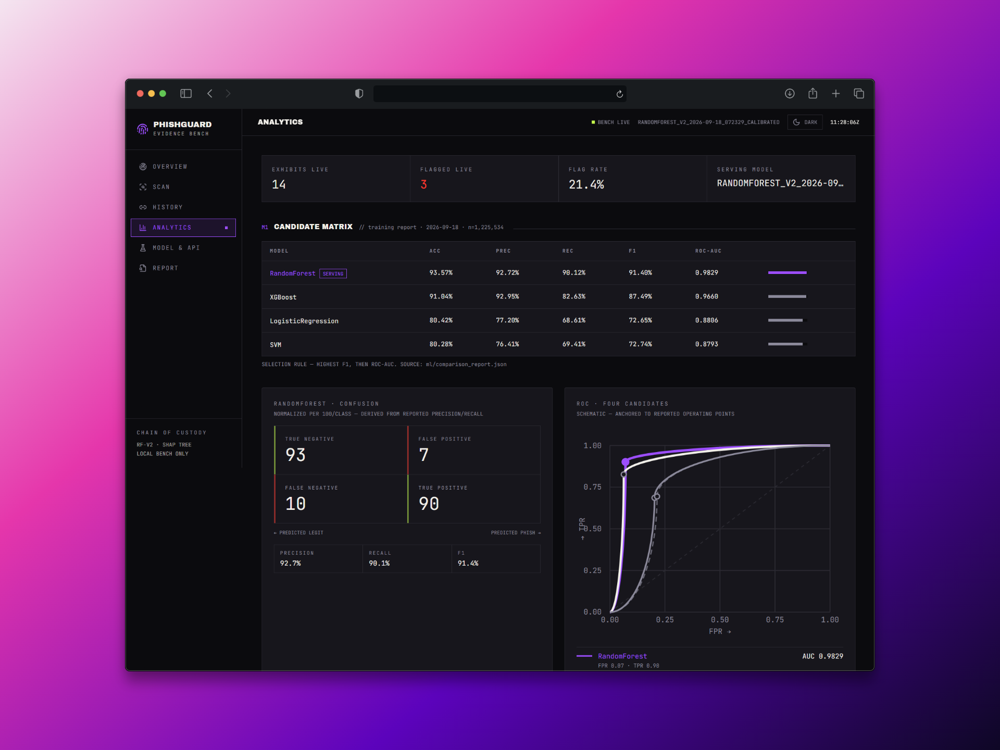
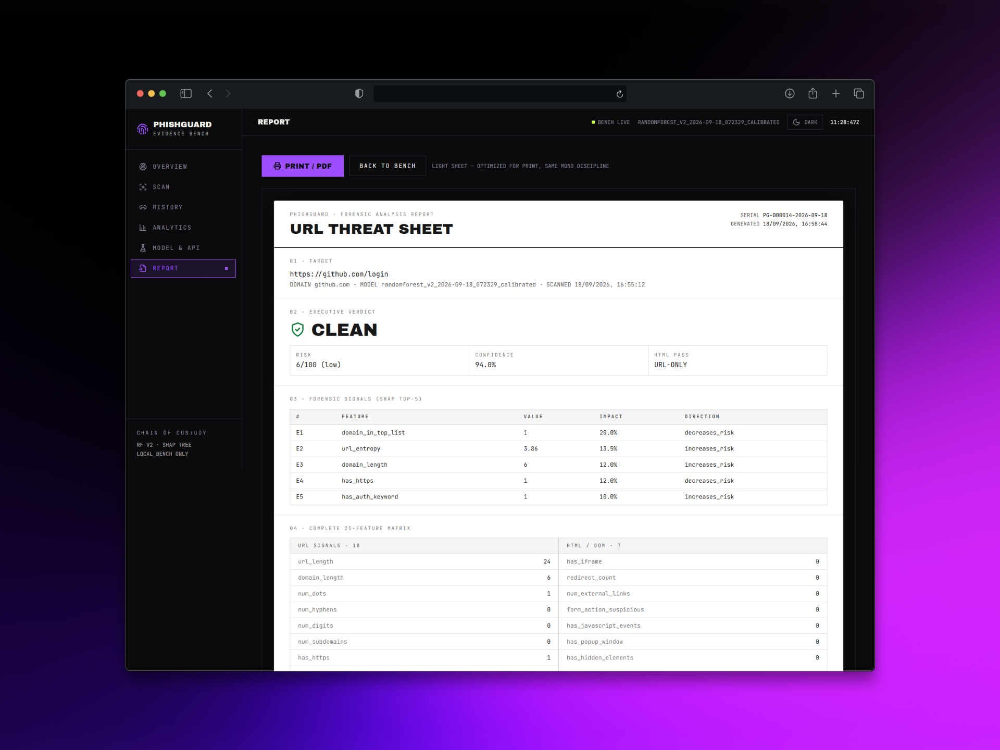

# PhishGuard — Intelligent Phishing URL Detection

> Paste a URL, get a verdict. **Phishing** or **legitimate** — with a 0–100 risk score,
> calibrated confidence, and the top signals that decided it. Every scan is persisted
> to a searchable custody log.

[](phishing_detector/backend/.python-version)
[](phishing_detector/backend/app/main.py)
[](frontend/package.json)
[](phishing_detector/backend/requirements.txt)
[](phishing_detector/backend/app/services/explainability.py)
[](phishing_detector/backend/tests/)

See also [`OVERVIEW.md`](OVERVIEW.md) for the full architecture deep-dive,
25-feature matrix, and calibration analysis.

---

## Product tour

A full scan takes seconds — paste a URL, read the verdict and the five signals behind it:



---

## Highlights

| | |
|---|---|
| **Serving model** | Calibrated RandomForest · **93.6% accuracy · F1 91.4 · ROC-AUC 0.983** (1.23M URLs, 2026-09-18) |
| **Explainable** | SHAP top-5 contributing signals on every verdict — no black box |
| **Trust layers** | Vendored threat-feed pre-filter + advisory review band + frozen acceptance gate |
| **Full stack** | FastAPI (async) + React 18 + Vite 7 + Tailwind forensic UI + SQLite custody log |
| **Quality gates** | 49 backend tests green · `npm audit`: 0 vulnerabilities · pinned deps |

### The bench at a glance

The Overview page is the intake desk: live bench status (model loaded, database connected, active model version), a quick-scan bar, and the newest exhibits with verdicts and confidence. Everything below pulls from the same custody log the API writes to — no mock layer.



### A verdict with evidence, not just a label

Scanning runs the URL through a 25-feature hybrid vector (15 URL-structural + 3 reputation/keyword + 7 page/redirect signals, with graceful URL-only fallback) and a calibrated RandomForest at threshold 0.5 — no third-party threat APIs at serve time. The verdict ships with calibrated confidence, a 0–100 risk score (`low` / `medium` / `high`), and the SHAP top-5 signals that decided it. A clean login page and a real phish look like this side by side:





### Every scan on record

Every `/predict` persists URL, domain, verdict, confidence, risk, all 25 features, SHAP top-5, review/feed flags, model version, and timestamp. History reads that log newest-first with text search, verdict filters, per-row delete, CSV export, and pagination.



### Know the instrument you're trusting

Analytics shows the live counters alongside the frozen training evidence: the candidate matrix, confusion heatmap, and ROC curves straight from `ml/comparison_report.json` — so the serving decision (highest F1, then ROC-AUC) is auditable from the UI.



### Paperwork a report can carry

The Report page renders the last scan as a print-optimized white forensic sheet — target, executive verdict, SHAP top-5, full 25-feature matrix, and model signature footer — ready for PDF or print.



---

## How a scan works

```
Browser :5173 ── POST /predict {"url"} ──► FastAPI :8000
                                                    │
                       ┌────────────────────────────┼────────────────────────────┐
                       │  1. Threat-feed pre-filter │  exact URL match → phishing│
                       │     (vendored URLhaus      │  risk 100 + provenance     │
                       │      snapshot, offline)    │                            │
                       │  2. Feature extraction     │  25 URL signals            │
                       │  3. Calibrated RandomForest│  verdict @ threshold 0.5   │
                       │  4. SHAP top-5 signals     │  what decided it           │
                       │  5. Review band [0.40,0.60]│  advisory flag, never a    │
                       │                            │  verdict change            │
                       └────────────────────────────┼────────────────────────────┘
                                                    ▼
                                    SQLite custody log (scan + features +
                                    SHAP + review/feed flags) ──► /history
```

```jsonc
// POST /predict {"url": "https://github.com/login"} →
{
  "scan_id": 114,
  "url": "https://github.com/login",
  "domain": "github.com",
  "prediction": "legitimate",   // "phishing" | "legitimate" — never anything else
  "confidence": 0.937,
  "risk_score": 6,              // 0–100
  "risk_level": "low",          // "low" | "medium" | "high"
  "needs_review": false,        // calibrated p inside [0.40, 0.60]?
  "blocklist_hit": false,       // exact match in the threat-feed snapshot?
  "blocklist_source": null,     // e.g. "urlhaus-online" when hit
  "decision_threshold": 0.5,
  "model_version": "randomforest_v2_2026-09-15_064718_calibrated",
  "scanned_at": "2026-09-15T05:37:07Z",
  "top_features": [
    {"name": "domain_in_top_list", "value": true,
     "impact_score": 0.31, "direction": "decreases_risk"}
    // …4 more
  ],
  "features": {"url_length": 24, "domain_length": 6 /* …25 total */}
}
```

---

## Quickstart

### 1. Prerequisites

| Tool | Version | Notes |
|---|---|---|
| Python | **3.11** | Pinned by `phishing_detector/backend/.python-version`. Not 3.14 — scikit-learn has no prebuilt wheels there |
| [`uv`](https://docs.astral.sh/uv/) | any recent | Reproducible installs (the venv has no `pip`; it is uv-managed) |
| Node.js | 20.19+ (Vite 7 requires it; tested on 24.x) | Frontend only |
| RAM | 8 GB to serve · 16 GB to train | Artifact is ~0.8 GB and loads fully into memory |
| OS | Windows (PowerShell) primarily | macOS/Linux differ only in venv activation |

### 2. Backend (FastAPI)

```powershell
cd phishing_detector\backend
uv python install 3.11
uv venv --python 3.11 .venv
uv pip install --python .venv\Scripts\python.exe -r requirements.txt -r requirements-dev.txt
.\.venv\Scripts\Activate.ps1
Copy-Item .env.example .env     # real values stay local-only, gitignored
uvicorn app.main:app --reload --port 8000
```

> Use the `uv pip install --python …` form exactly. Bare `pip install` inside `.venv`
> silently falls through to another Python (e.g. 3.14) and fails building scikit-learn.
> Standard-library alternative when 3.11 is already installed: `py -3.11 -m venv .venv`.

- API: `http://localhost:8000` · Swagger: `http://localhost:8000/docs` · Health: `http://localhost:8000/health`

Why deps are `==`-pinned (`requirements.txt`): the trained artifact is a pickle —
loading it under a different sklearn/XGBoost/SHAP version can fail or silently shift
predictions. Retrain before upgrading. Details in `OVERVIEW.md`.

Without an artifact the API still runs via a deterministic heuristic fallback
(`ALLOW_HEURISTIC_FALLBACK=true`) so the UI is demonstrable before training.

### 3. Frontend (React + Vite)

```powershell
cd frontend
npm install   # first time only
npm run dev   # → http://localhost:5173 (proxies /api → :8000)
```

Production build (also the template check): `npm run build`.

### 4. Verify

| Check | How | Healthy |
|---|---|---|
| Backend alive | `GET localhost:8000/health` | `{"status":"ok","model_loaded":true,…}` |
| Real model | `GET localhost:8000/model-info` | `"model_name":"RandomForest"` (not `HeuristicFallback`) |
| Predict | `POST localhost:8000/predict` `{"url":"https://github.com/login"}` | `legitimate`, `risk_score` 6, 5 `top_features` |
| UI | `http://localhost:5173` | Overview loads; end-to-end scan works |

---

## Model lifecycle — train · calibrate · gate

Training data is **local-only and gitignored**. Place your dataset in
`phishing_detector/backend/ml/data/` — the trainer uses the largest `.csv` found there
(`hard_negatives.csv` is always appended as extra legitimate rows):

| File in `ml/data/` | Purpose | Committed? |
|---|---|---|
| `phish_urls.csv` (`url,label`) | Labeled dataset | No |
| `reputation_top1m.csv` (`rank,domain`) | Cisco Umbrella top-1M for `domain_in_top_list` | No |
| `hard_negatives.csv` | Curated top-site logins (all `0`) | **Yes** |
| `eval_gate.json` | Frozen 40-URL acceptance set | **Yes** |
| `feed_blocklist.csv` | Vendored URLhaus snapshot | **Yes** |

```powershell
cd phishing_detector\backend
.\.venv\Scripts\Activate.ps1

python -m ml.train            # hours on 1.2M rows → models/best_model.pkl + ml/comparison_report.json
python ml/calibrate.py        # minutes → isotonic-calibrated candidate + ml/calibration_report.json
python eval_gate.py           # exit 0 ships: ≥85% on frozen 40, github/login < 0.30, zero top-site misses
```

Restart the backend after swapping artifacts — the model loads once at startup.

**Benchmarks (1,225,534 URLs, 2026-09-18)** — full table in `OVERVIEW.md`:

| Model | Acc | F1 | ROC-AUC |
|---|---|---|---|
| **RandomForest** | **93.57%** | **91.40** | **0.9829** |
| XGBoost | 91.04% | 87.49 | 0.9660 |
| Logistic Regression | 80.42% | 72.65 | 0.8806 |
| SVM (calibrated linear) | 80.28% | 72.74 | 0.8793 |

Calibration effect (held-out): Brier 0.0490 → 0.0464, log-loss 0.1686 → 0.1560,
F1 91.44 → 91.39 (precision up, recall down slightly), ROC-AUC flat. Threshold stays
0.5; measured alternatives live in `ml/calibration_report.json`.

---

## Trust layers

- **Threat-feed pre-filter** (`app/services/blocklist.py`) — normalized exact-URL match
  against `ml/data/feed_blocklist.csv`. A hit outranks the model (phishing, risk 100)
  with `blocklist_hit` / `blocklist_source` provenance. Refresh weekly:
  `python ml/refresh_blocklist.py`. Disable via `BLOCKLIST_ENABLED=false`.
- **Review band** (`needs_review`, defaults 0.40–0.60) — advisory only, never changes the
  verdict (~3.3% of traffic at ~45% error: route to an analyst).
- **Operating point** (`DECISION_THRESHOLD`, default 0.5) — echoed by every response and
  `/model-info`. The frozen gate assumes 0.5; preview others with `eval_gate.py --threshold <t>`.

---

## Configuration

Copy `phishing_detector/backend/.env.example` → `.env` (gitignored):

| Variable | Default | Meaning |
|---|---|---|
| `DATABASE_URL` | `sqlite:///./phishguard.db` | SQLite file, auto-created + auto-migrated on startup |
| `MODEL_PATH` | `models/best_model.pkl` | Trained artifact, relative to `backend/` |
| `MODEL_METADATA_PATH` | `ml/comparison_report.json` | Training report behind `/model-info` |
| `CORS_ORIGINS` | `http://localhost:5173` | Allowed frontend origin |
| `ENABLE_HTML_SCRAPING` | `false` | Fetch pages for 7 DOM features (off = URL-only) |
| `SCRAPER_TIMEOUT_SECONDS` | `4.0` | Per-fetch timeout |
| `ALLOW_HEURISTIC_FALLBACK` | `true` | Rule-based verdicts when no artifact exists |
| `LOG_LEVEL` | `INFO` | Verbosity |
| `BLOCKLIST_PATH` / `BLOCKLIST_ENABLED` | `ml/data/feed_blocklist.csv` / `true` | Threat-feed snapshot + toggle |
| `DECISION_THRESHOLD` | `0.5` | Verdict operating point |
| `REVIEW_BAND_LOW` / `REVIEW_BAND_HIGH` | `0.4` / `0.6` | Advisory low-margin band |

Frontend overrides (`frontend/.env.example`): `VITE_API_BASE`, `VITE_API_URL`, `VITE_DOCS_URL`
— data fetching always uses the relative `/api` base in dev.

---

## Testing

```powershell
# Backend — API contract, features, degradation, feed/review/threshold,
# v3 signals, HTML collector, legacy-DB migration
cd phishing_detector\backend
.\.venv\Scripts\Activate.ps1
python -m pytest tests/ -q

# One file / one test:
pytest tests\test_features.py -v
pytest tests\test_api.py::test_predict_and_history -v

# Frontend
cd frontend
npm run build
```

---

## API reference

| Method | Route | Purpose |
|---|---|---|
| POST | `/predict` | `{"url"}` → verdict, confidence, risk 0–100, SHAP top-5, 25-feature vector, review/feed flags; persisted |
| GET | `/history?page=&per_page=&prediction=` | Newest-first custody log + pagination |
| DELETE | `/history/{scan_id}` | Delete one record (204) |
| GET | `/model-info` | Model metrics, training timestamp, active threshold |
| GET | `/health` | `status`, `model_loaded`, `database_connected` |
| GET | `/docs` | Themed Swagger console |

---

## Project structure

```
PhishGuard/
├── README.md                        # this file — start here
├── OVERVIEW.md                      # system design + architecture deep-dive
├── frontend/                        # React 18 + Vite 7 + Tailwind
│   └── src/{pages,components,services,utils}  # 6 pages, api client, verdict system
├── phishing_detector/backend/
│   ├── app/{routers,services,models,schemas,core,static}  # API + inference
│   ├── models/                      # best_model.pkl lives here after training (local-only)
│   ├── ml/{train,calibrate,evaluate} # pipeline + calibration + benchmarks
│   ├── ml/{refresh_blocklist,collect_html,rdap,v3_signals}  # feeds + retrain readiness
│   ├── ml/{comparison,calibration}_report.json  # training + calibration evidence
│   ├── ml/data/{eval_gate.json,hard_negatives.csv,feed_blocklist.csv}
│   ├── tests/                       # pytest suite
│   ├── eval_gate.py                 # frozen acceptance gate (exit 0 = ship)
│   ├── requirements{,-dev}.txt      # pinned deps (see Quickstart why)
│   └── .env.example                 # copy to .env (see Configuration)
```

Training data (`*.csv` except the three companions above), `*.pkl` artifacts,
`*.db` files, and `.env` are local-only and gitignored — regenerated via the steps above.

---

## Troubleshooting

| Symptom | Cause → fix |
|---|---|
| `pip install` fails building `scikit-learn` | Wrong Python (3.14+) or bare `pip` hit another interpreter — use 3.11 via `uv` |
| `:5173` won't bind / stale UI | Kill leftover `node.exe …vite`, `npm run dev` fresh, hard-refresh (Ctrl+Shift+R) |
| `/model-info` says `HeuristicFallback` | No artifact at `MODEL_PATH` → train or fix `.env`, restart backend |
| First start hangs | Normal: loading ~0.8 GB — wait for `application_started`, don't start a second instance |
| Every `/predict` is 500 | Read backend traceback; `test_extract_all_contains_contract` guards feature counts |
| `/history` empty after scans | History lives in `phishguard.db` next to the backend — deleting it wipes history (recreates on restart) |
| Theme toggle stuck | Theme persists in `localStorage` (`phishguard-theme`) — clear site data |

---

## Further reading

- `OVERVIEW.md` — architecture, 25-feature matrix, calibration analysis, trust layers
- `phishing_detector/backend/ml/` — training, calibration, eval gate, and retrain-readiness scripts (`v3_signals.py`, `collect_html.py`, `rdap.py`)
